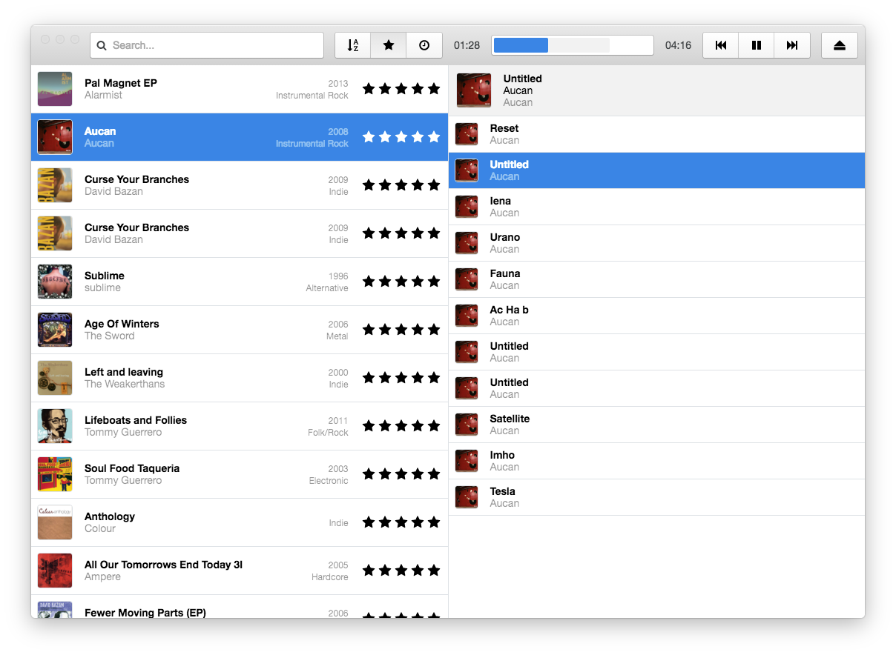

<div align="center">


# 🎵 Plex Music

### Plataforma moderna de streaming musical 🚀

<p align="center">
  Plex Music es una aplicación multimedia enfocada en reproducción y gestión de música, diseñada para ofrecer una experiencia elegante, rápida y moderna inspirada en plataformas premium de streaming.
</p>

<p align="center">
  
  
  
  
  
  
</p>

<p align="center">
  <a href="#-preview">Preview</a> •
  <a href="#-características">Características</a> •
  <a href="#-tecnologías-utilizadas">Tecnologías</a> •
  <a href="#-instalación">Instalación</a> •
  <a href="#-roadmap">Roadmap</a>
</p>

</div>

---

# 🌊 Acerca de Plex Music

**Plex Music** es una aplicación enfocada en streaming y reproducción musical con una interfaz moderna y minimalista.

El proyecto busca ofrecer una experiencia multimedia fluida para escuchar música, gestionar playlists y disfrutar de una interfaz inspirada en aplicaciones premium de entretenimiento.

La aplicación integra reproducción avanzada, navegación intuitiva y un diseño responsive optimizado para dispositivos modernos.

---

# 📸 Preview

<div align="center">



</div>

---

# ✨ Características

# 🎧 Reproductor Multimedia

- ▶️ Reproducción de música
- ⏯️ Controles Play / Pause
- ⏭️ Next / Previous
- 🔊 Control de volumen
- 📍 Barra de progreso interactiva
- 🎵 Gestión multimedia

---

# 🎶 Biblioteca Musical

- 📂 Organización de canciones
- 💿 Álbumes
- 🎤 Artistas
- 📜 Playlists
- 🔍 Búsqueda musical

---

# 🎨 Interfaz Moderna

- ✨ Diseño minimalista
- 🌙 Dark Mode
- 📱 Responsive UI
- ⚡ Navegación fluida
- 🎵 Experiencia inspirada en plataformas premium

---

# 🚀 Streaming & Performance

- 🌐 Streaming musical
- ⚡ Carga rápida
- 💾 Caché multimedia
- 🔄 Sincronización dinámica
- 🎧 Audio optimizado

---

# 🎥 Demo

<div align="center">

https://user-images.githubusercontent.com/demo/plexmusic-demo.mp4

</div>

---

# 🛠️ Tecnologías Utilizadas

## 💻 Desarrollo

<p>
  
</p>

- JavaScript
- HTML5
- CSS3
- Node.js

---

## 🎵 Multimedia

- Audio APIs
- Media Streaming
- Media Controls
- Dynamic Playback

---

## 🎨 UI & UX

- Modern UI Components
- Responsive Design
- Dark Theme
- Interactive Animations

---

## 🧰 Herramientas

<p>
  
</p>

- Git & GitHub
- VS Code
- npm
- Modern Frontend Tooling

---

# 📂 Estructura del Proyecto

```bash
PlexMusic/
│
├── assets/              # Recursos multimedia
├── components/          # Componentes UI
├── pages/               # Pantallas principales
├── services/            # APIs y lógica multimedia
├── styles/              # Estilos CSS
├── utils/               # Utilidades
├── screenshot.png
└── README.md
```

---

# ⚡ Instalación

## 1️⃣ Clonar el repositorio

```bash
git clone https://github.com/isairey/AppEscucharMusica.git
cd AppEscucharMusica
```

---

# 🔥 Requisitos

- Node.js 18+
- npm o yarn
- Navegador moderno
- VS Code recomendado

---

# ▶️ Ejecutar Proyecto

## Instalar dependencias

```bash
npm install
```

---

## Ejecutar aplicación

```bash
npm start
```

---

# 🚀 Funcionalidades Completadas

## ✅ Implementado

- 🎵 Reproductor multimedia
- 🎨 UI moderna
- 🌙 Dark Mode
- 📂 Biblioteca musical
- 🔍 Buscador de canciones
- ⚡ Navegación rápida

---

# 📊 Roadmap

## 🚧 Próximamente

- ❤️ Sistema de favoritos
- ☁️ Sincronización cloud
- 🎶 Letras sincronizadas
- 📱 Aplicación móvil
- 🤖 Recomendaciones inteligentes
- 🎧 Ecualizador avanzado
- 🌍 Multi-language support

---

# 🤝 Contribuciones

Las contribuciones son bienvenidas ❤️

## Pasos para contribuir

1. Haz Fork del proyecto
2. Crea una rama

```bash
git checkout -b feature/nueva-funcion
```

3. Realiza tus cambios
4. Haz commit

```bash
git commit -m "✨ Nueva funcionalidad"
```

5. Haz push

```bash
git push origin feature/nueva-funcion
```

6. Abre un Pull Request 🚀

---

# 👨‍💻 Autor

<div align="center">


## Isai Reyes

Desarrollador Full Stack apasionado por aplicaciones multimedia, interfaces modernas y experiencias musicales.

</div>

---

# 🌟 Apoya el Proyecto

Si te gusta Plex Music:

⭐ Dale una estrella al repositorio  
🍴 Haz Fork del proyecto  
📢 Compártelo con otros desarrolladores

---

# 📜 Licencia

Este proyecto está bajo la licencia **MIT**.

---

<div align="center">

### 🎶 Plex Music — Música moderna con una experiencia premium.

</div>
